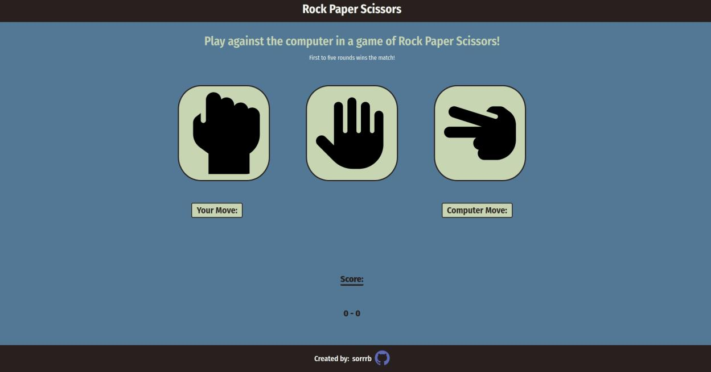

# rock-paper-scissors
A webpage implementation of the game Rock, Paper, Scissors using JavaScript ES6 

## Demo Preview

[Link](https://sorrrb.github.io/rock-paper-scissors/)

### Languages utilized:
- HTML
- CSS
- JavaScript (vanilla)

### Defined skills:
- Flexbox position/layout
- SVG filetype usage
- Functions (function declarations, function calls, function scope, callback functions)
- Data types
- Operations (assignments, operators, operands)

## Attribution(s):
[Pixel perfect](https://www.flaticon.com/authors/pixel-perfect) (https://icon54.com) - GitHub SVG icon usage in footer