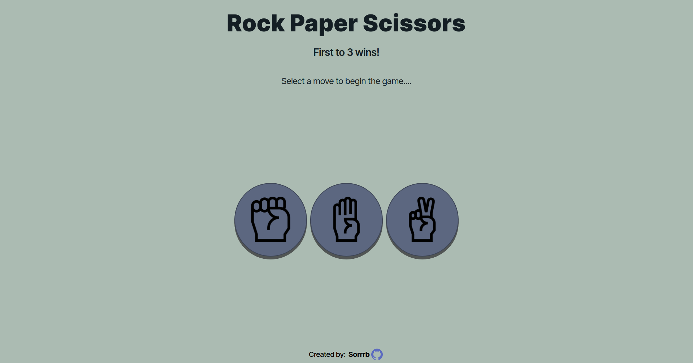
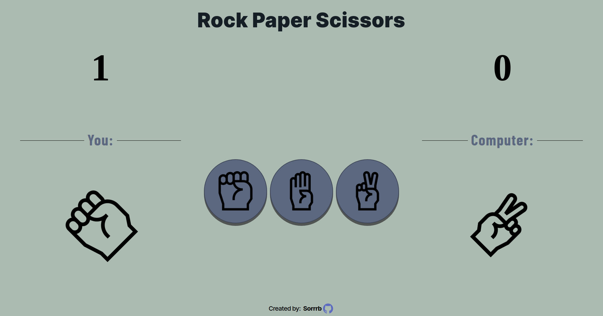

# rock-paper-scissors
A webpage implementation of the game Rock, Paper, Scissors using JavaScript 

[Live Demo](https://sorrrb.github.io/rock-paper-scissors/)

## Demo Preview

### Languages
- HTML
- CSS
- JavaScript

### Concepts
- Flexbox
- CSS Grid
- Pseudo-classes
- DOM manipulation methods
- Module pattern
- Closure

## Attribution(s)
[Pixel perfect](https://www.flaticon.com/authors/pixel-perfect) (https://icon54.com) - GitHub SVG icon usage in footer