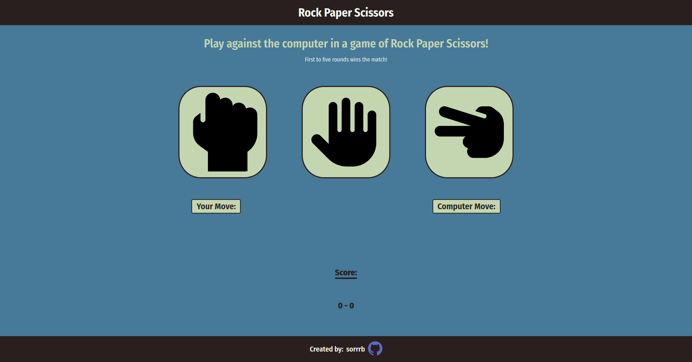

# rock-paper-scissors
A webpage implementation of the game Rock, Paper, Scissors using JavaScript 

[Live Demo](https://sorrrb.github.io/rock-paper-scissors/)

## Demo Preview

### Languages utilized:
- HTML
- CSS
- JavaScript (vanilla - ES6)

### Defined skills:
- CSS Flexbox
- Usage of .SVG filetype
- Arrow functions & callbacks
- Data types & typecasting

## Attribution(s):
[Pixel perfect](https://www.flaticon.com/authors/pixel-perfect) (https://icon54.com) - GitHub SVG icon usage in footer